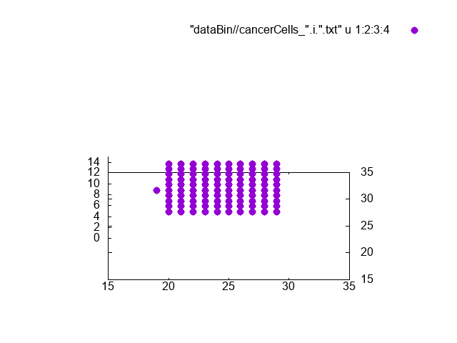

# An actively developed C++ code to learn about Moran processes, and investigate some simple spatio-temporal effects of a diffusing cytokine field over a naturally growing cell mass modeled by the Moran process.
This work is simply for fun.
## Program written in C++, visualization is currently simply done with Gnuplot.

Purple cells are actively growing cancer cells, grey cells are cells that have been deactivated by the induced cytokine response.
